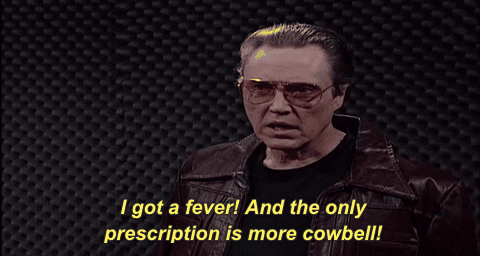
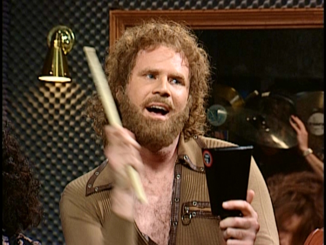

# More Cowbell

Project by Anne Ensign

Analysis between various statistics of Christopher Walken's film career and popular music that utilizes the cowbell.

JUMP TO:
* [Methodology](#methodology)
* [Running the program](#running-the-program)
* [Requirements met for Code Louisville](#requirements)
* [Footnotes](#footnotes)



## INTRODUCTION
The Saturday Night Live sketch "More Cowbell" aired on April 8, 2000.[^1] It quickly because a pop culture sensation.  Will Ferrell, an SNL cast member and writer, was responsible for penning the famous sketch.[^2] On *The Tonight Show Starring Jimmy Fallon* in 2019, Ferrell recounted a conversation (with tongue-in-cheek) that he had backstage with Walken after a play:

> “You know, you’ve ruined my life. People, during the curtain call, bring cowbells and ring them. The other day I went for an Italian food lunch, and the waiter asked if I wanted more cowbell with my pasta bolognese.”[^3]

I am curious to see if there is any correlation with Walken's film career (ratings, number of films per year, etc.) and popular songs that incorporate cowbell into the percussion instruments used in recording. 

## METHODOLOGY

Sample size was comprised of:
* 111 Christopher Walken films
* 4284 songs with cowbell
* 1369 popular songs to find mutual instances with cowbell songs
* Final list of 130 songs mutual instances

**Walken Data**

I accessed www.RottenTomatoes.com for Walken's films. Since the list was fairly short, it was easiest to copy/paste the data into a spreadsheet and create a CSV.

**Cowbell Data**

I made three web scrapers to collect song data:
1. `cowbell.py` This scraper ran through 4247 pages of UltimateCowbell.com[^4] to extract song information and wrote a CSV of the dataframe.
2. `script.js` This was a manual scraper. RollingStone.com[^5] had a list of "The 500 Greatest Songs of All Time," which I wanted to cross-check against the UltimateCowbell list. Rolling Stone's site is a dynamically loaded website, so the python scraper couldn't read the contents of the HTML. I only needed to run the scraper on 10 pages, so I made a JavaScript code to run in the console and copy/pasted the output into a spreadsheet. 
3. `billboard.py` This scraper ran through Wikipedia's lists of the Billboard's Hot 100 Singles[^6] between 1970 and 2020 and wrote a CSV. This list includes any single that reached a #1 position on the charts during this time, with pages separated by decades.  

I also copy/pasted a couple smaller lists of "best cowbell songs" and placed in another CSV to add to my cowbell sample size.[^7][^8] 

Overall, over 5,600 songs were taken into the data and analyzed. The final list came to 131 cowbell songs that are popular/mainstream, with release dates ranging from 1964 to 2017, and genres such as Rock, Country, R&B, Pop and more. See Methodology section for more detailed information. 

## RUNNING THE PROGRAM

### Easy Option: Colab

If you have a Google account, you can easily run this program in Colab- no downloads, packages or virtual environments needed. 

1. [CLICK HERE FOR COLAB LINK](https://colab.research.google.com/drive/1PsxmpVZMSOpZSJAsURxGqrcKxoMAgcLl?usp=sharing)
2. Once open, click `File > Save a Copy in Drive`
3. Your copied version should automatically open.
4. On the top tab bar, click `Runtime > Run all`
5. Ta-da! That's it.

### Tools and Libraries

This repo utilizes a number of tools, frameworks and libraries that are all included with Anaconda. 
    [Anaconda documentation and install](https://docs.anaconda.com)
Anaconda released an update on [September 24, 2020](https://docs.anaconda.com/anaconda/navigator/release-notes/). This repo runs on that latest release. 

You can update by opening your terminal and enter:
```
conda update conda
conda install anaconda=VersionNumber
```
[Click here](https://docs.anaconda.com/anaconda/install/update-version/) for notes on updating. 

If you do not wish to install Anaconda, be sure your machine has the following:
* [Python 3.0 or higher](https://www.python.org)
* [Jupyter Notebook](https://jupyter.org)
* [pandas](https://pandas.pydata.org/pandas-docs/stable/index.html)
* [NumPy](https://numpy.org/doc/)
* [Matplotlib](https://matplotlib.org)
* [PyPi](https://pypi.org) to install the following:
  * [SciPy](https://docs.scipy.org/doc/scipy/getting_started.html#getting-started-ref)
  * [Seaborn](https://seaborn.pydata.org/index.html)

To add these packages with pip, install:

```
pip install notebook
pip install pandas
pip install numpy
python -m pip install -U pip
python -m pip install -U matplotlib
pip install scipy
pip install seaborn
```

### Running the Program in Jupyter Notebook
1. Clone the repository.
2. Save the folder.
3. Open `jupyter notebook` from command line or start menu.
4. Navigate to the saved location of the repo.
5. Open `walken.ipynb`.
6. Click `Cell` tab and then `Run All`.
   
### Web Scrapers

If you cloned or downloaded this entire repo, you should have the CSVs that the web scrapers have made already available. These include:
* `cowbell1_4247.csv`
* `billboard.csv`

If you want to run these on your own:

1. Install [Beautiful Soup](https://www.crummy.com/software/BeautifulSoup/#Download)
2. If desired, change folder location to download the CSVs. For example:
   
    `df.to_csv(f'billboard.csv', sep=',', encoding='utf-8-sig', index = False)` 

	to

    `df.to_csv(f'./csv/billboard.csv', sep=',', encoding='utf-8-sig', index = False)`

3. Run the file in your terminal.
   
    `python cowbell.py`

    `python billboard.py`
    
## REQUIREMENTS

Requirements met for Code Louisville:

1. Create a dictionary or list, populate it with several values, retrieve at least one value, and use it in your program.
2. Read data from an external file, such as text, JSON, CSV, etc and use that data in your application.
3. Create and call at least 3 functions or methods, at least one of which must return a value that is used somewhere else in your code.
4. Analyze text and display information about it (ex: how many words in a paragraph).
5. Visualize data in a graph, chart, or other visual representation of data.
6. Implement a “scraper” that can be fed a type of file or URL and pull information off of it.
7. Use pandas, matplotlib, and/or numpy to perform a data analysis project. Ingest 2 or more pieces of data, analyze that data in some manner, and display a new result to a graph, chart, or other display.



## FOOTNOTES:

[^1]: [More Cowbell - SNL](https://www.youtube.com/watch?v=cVsQLlk-T0s), *Saturday Night Live*, YouTube
[^2]: [Recording Session (More Cowbell)](https://www.rollingstone.com/tv/tv-lists/my-favorite-saturday-night-live-sketch-119386/recording-session-more-cowbell-121088/), interview with Will Ferrell, *Rolling Stone Magazine.* 
[^3]: [Will Ferrell Ruined Christopher Walken's Life with SNL's More Cowbell Sketch](https://www.youtube.com/watch?v=j8kIzOr6DP8), *The Tonight Show Starring Jimmy Fallon*, YouTube
[^4]: [UltimateCowbell](http://ultimatecowbell.com)
[^5]: [Rolling Stone](https://www.rollingstone.com/music/music-lists/best-songs-of-all-time-1224767/kanye-west-stronger-1224837/)
[^6]: [List of Billboard Hot 100 Singles by Decade](https://en.wikipedia.org/wiki/List_of_Billboard_Hot_100_number-one_singles_of_the_1970s)
[^7]: [A to Z Songs that were Made Great by the Cowbell](https://medium.com/@s3605546/a-to-z-songs-that-were-made-great-by-the-cowbell-3734dd3a3535)
[^8]: [Friday Top: 25 Best Songs with Cowbell](https://www.ultimate-guitar.com/articles/features/friday_top_25_best_songs_with_cowbell-112673)